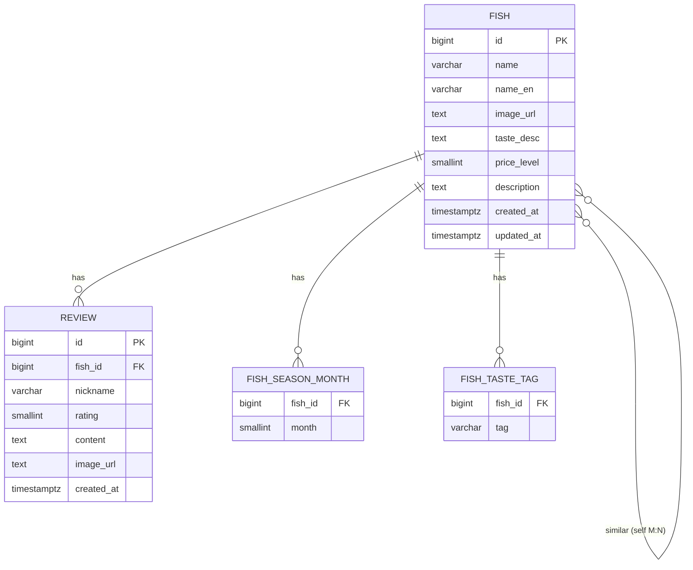

# FishNote — DB 설계서 (PostgreSQL)

> 이 문서의 §1~§7 DDL은 초기 설계 기록이다. 현재 스키마의 유일한 실행 source of truth는
> `BE/src/main/resources/db/migration/V1__create_schema.sql`부터 이어지는 Flyway 파일이며,
> 현행 V8~V20 확장은 §8에 정리한다. 운영 DB에 이 문서의 DDL을 수동 실행하지 않는다.
> DB: PostgreSQL 16 / ORM: Spring Data JPA (Hibernate)

---

## 1. ERD



---

## 2. 테이블 정의

### `fish` — 생선 (메인)
| 컬럼 | 타입 | 제약 | 설명 |
|---|---|---|---|
| id | BIGSERIAL | PK | |
| name | VARCHAR(100) | NOT NULL | 이름 (예: 광어) |
| name_en | VARCHAR(100) | | 영문/학명 |
| image_url | TEXT | | 대표 사진 URL |
| taste_desc | TEXT | | 맛 설명 문장 |
| price_level | SMALLINT | CHECK 1~3 | 1=저렴 2=중간 3=고급 |
| description | TEXT | | 한 줄 소개 |
| created_at | TIMESTAMPTZ | DEFAULT now() | |
| updated_at | TIMESTAMPTZ | | |

### `review` — 후기 (1:N, fish 1개 ↔ review N개)
| 컬럼 | 타입 | 제약 | 설명 |
|---|---|---|---|
| id | BIGSERIAL | PK | |
| fish_id | BIGINT | FK→fish, NOT NULL | |
| nickname | VARCHAR(30) | NOT NULL | 익명 작성자 |
| rating | SMALLINT | CHECK 1~5 | 별점 (선택) |
| content | TEXT | NOT NULL | 후기 본문 |
| image_url | TEXT | | 사진 (선택) |
| created_at | TIMESTAMPTZ | DEFAULT now() | |

### `fish_season_month` — 제철 월 (컬렉션)
| 컬럼 | 타입 | 제약 |
|---|---|---|
| fish_id | BIGINT | FK→fish |
| month | SMALLINT | CHECK 1~12, PK(fish_id, month) |

> 예: 광어 → (11),(12),(1),(2). 계절 필터는 month로 조회.

### `fish_taste_tag` — 맛 태그 (컬렉션)
| 컬럼 | 타입 | 제약 |
|---|---|---|
| fish_id | BIGINT | FK→fish |
| tag | VARCHAR(30) | PK(fish_id, tag) |

> 예: 광어 → "담백", "쫄깃". 태그 필터는 tag로 조회.

### `fish_similar` — 비슷한 생선 (self N:M)
| 컬럼 | 타입 | 제약 |
|---|---|---|
| fish_id | BIGINT | FK→fish |
| similar_fish_id | BIGINT | FK→fish, PK(fish_id, similar_fish_id) |

### `market_price_observation` — 시장 가격 관측값
| 컬럼 | 타입 | 제약 | 설명 |
|---|---|---|---|
| id | BIGSERIAL | PK | |
| fish_id | BIGINT | FK→fish, nullable | 앱 어종과 매핑된 경우 연결 |
| source | VARCHAR(50) | NOT NULL | 예: `noryangjin` |
| market | VARCHAR(100) | NOT NULL | 예: 노량진수산물도매시장 |
| observed_date | DATE | NOT NULL | 경락시세 기준일 |
| canonical_fish_name | VARCHAR(100) | | 앱 내부 어종명 |
| noryangjin_species_name | VARCHAR(100) | NOT NULL | 노량진 어종명, 예: 넙치 |
| source_species_name | VARCHAR(100) | NOT NULL | 원문 어종명, 예: `(활)참돔` |
| trade_state | VARCHAR(20) | | 활/선 등 원문 접두어 |
| origin | VARCHAR(100) | | 산지 |
| spec | VARCHAR(100) | | 규격 |
| package_unit | VARCHAR(50) | | 포장/단위 |
| quantity | NUMERIC(12,2) | | 수량 |
| weight | NUMERIC(12,2) | | 어종별 시세 화면의 중량 |
| high_price_krw | INTEGER | | 낙찰고가 |
| low_price_krw | INTEGER | | 낙찰저가 |
| avg_price_krw | INTEGER | | 평균가 |
| source_url | TEXT | | 수집 원천 URL |
| collected_at | TIMESTAMPTZ | DEFAULT now() | 수집 시각 |

### `shop_price_observation` — 상회/카톡방 시세 관측값
| 컬럼 | 타입 | 제약 | 설명 |
|---|---|---|---|
| id | BIGSERIAL | PK | |
| fish_id | BIGINT | FK→fish, nullable | 앱 어종과 매핑된 경우 연결 |
| observed_at | TIMESTAMPTZ | NOT NULL | 시세가 올라온 시각 |
| source_type | VARCHAR(50) | NOT NULL | `kakao_openchat`, `shop_manual` 등 |
| source_name | VARCHAR(100) | | 오픈채팅방/상회 이름 |
| speaker | VARCHAR(100) | | 카톡 작성자/상회명 |
| canonical_fish_name | VARCHAR(100) | | 앱 내부 어종명 |
| reported_name | VARCHAR(100) | NOT NULL | 원문에서 잡힌 어종명 |
| condition | VARCHAR(50) | | 활/선/양식/자연산 등 |
| origin | VARCHAR(100) | | 산지 |
| size_grade | VARCHAR(100) | | 크기/규격 |
| unit | VARCHAR(30) | | kg/마리/팩/박스 |
| price_min_krw | INTEGER | NOT NULL | 최저가 |
| price_max_krw | INTEGER | NOT NULL | 최고가 |
| confidence | NUMERIC(3,2) | DEFAULT 0.5 | 파싱 신뢰도 |
| raw_text | TEXT | NOT NULL | 검수용 원문 |
| collected_at | TIMESTAMPTZ | DEFAULT now() | 수집 시각 |

---

## 3. DDL (실행용)

```sql
-- 생선
CREATE TABLE fish (
    id          BIGSERIAL PRIMARY KEY,
    name        VARCHAR(100) NOT NULL,
    name_en     VARCHAR(100),
    image_url   TEXT,
    taste_desc  TEXT,
    price_level SMALLINT CHECK (price_level BETWEEN 1 AND 3),
    description TEXT,
    created_at  TIMESTAMPTZ NOT NULL DEFAULT now(),
    updated_at  TIMESTAMPTZ
);

-- 제철 월
CREATE TABLE fish_season_month (
    fish_id BIGINT NOT NULL REFERENCES fish(id) ON DELETE CASCADE,
    month   SMALLINT NOT NULL CHECK (month BETWEEN 1 AND 12),
    PRIMARY KEY (fish_id, month)
);

-- 맛 태그
CREATE TABLE fish_taste_tag (
    fish_id BIGINT NOT NULL REFERENCES fish(id) ON DELETE CASCADE,
    tag     VARCHAR(30) NOT NULL,
    PRIMARY KEY (fish_id, tag)
);

-- 비슷한 생선 (self many-to-many)
CREATE TABLE fish_similar (
    fish_id         BIGINT NOT NULL REFERENCES fish(id) ON DELETE CASCADE,
    similar_fish_id BIGINT NOT NULL REFERENCES fish(id) ON DELETE CASCADE,
    PRIMARY KEY (fish_id, similar_fish_id),
    CHECK (fish_id <> similar_fish_id)
);

-- 시장 가격 관측값
CREATE TABLE market_price_observation (
    id                      BIGSERIAL PRIMARY KEY,
    fish_id                 BIGINT REFERENCES fish(id) ON DELETE SET NULL,
    source                  VARCHAR(50) NOT NULL,
    market                  VARCHAR(100) NOT NULL,
    observed_date           DATE NOT NULL,
    canonical_fish_name     VARCHAR(100),
    noryangjin_species_name VARCHAR(100) NOT NULL,
    source_species_name     VARCHAR(100) NOT NULL,
    trade_state             VARCHAR(20),
    origin                  VARCHAR(100),
    spec                    VARCHAR(100),
    package_unit            VARCHAR(50),
    quantity                NUMERIC(12, 2),
    weight                  NUMERIC(12, 2),
    high_price_krw          INTEGER,
    low_price_krw           INTEGER,
    avg_price_krw           INTEGER,
    source_url              TEXT,
    collected_at            TIMESTAMPTZ NOT NULL DEFAULT now()
);

-- 상회/카톡방/수동 입력 기반 시세 관측값
CREATE TABLE shop_price_observation (
    id                  BIGSERIAL PRIMARY KEY,
    fish_id             BIGINT REFERENCES fish(id) ON DELETE SET NULL,
    observed_at         TIMESTAMPTZ NOT NULL,
    source_type         VARCHAR(50) NOT NULL,
    source_name         VARCHAR(100),
    speaker             VARCHAR(100),
    canonical_fish_name VARCHAR(100),
    reported_name       VARCHAR(100) NOT NULL,
    condition           VARCHAR(50),
    origin              VARCHAR(100),
    size_grade          VARCHAR(100),
    unit                VARCHAR(30),
    price_min_krw       INTEGER NOT NULL,
    price_max_krw       INTEGER NOT NULL,
    confidence          NUMERIC(3, 2) NOT NULL DEFAULT 0.5,
    raw_text            TEXT NOT NULL,
    collected_at        TIMESTAMPTZ NOT NULL DEFAULT now()
);

-- 후기
CREATE TABLE review (
    id         BIGSERIAL PRIMARY KEY,
    fish_id    BIGINT NOT NULL REFERENCES fish(id) ON DELETE CASCADE,
    nickname   VARCHAR(30) NOT NULL,
    rating     SMALLINT CHECK (rating BETWEEN 1 AND 5),
    content    TEXT NOT NULL,
    image_url  TEXT,
    created_at TIMESTAMPTZ NOT NULL DEFAULT now()
);

-- 인덱스
CREATE INDEX idx_review_fish ON review(fish_id);
CREATE INDEX idx_season_month ON fish_season_month(month);
CREATE INDEX idx_taste_tag ON fish_taste_tag(tag);
CREATE INDEX idx_fish_name ON fish(name);
CREATE INDEX idx_market_price_fish_date ON market_price_observation(fish_id, observed_date DESC);
CREATE INDEX idx_market_price_species_date ON market_price_observation(noryangjin_species_name, observed_date DESC);
CREATE INDEX idx_shop_price_fish_observed ON shop_price_observation(fish_id, observed_at DESC);
CREATE INDEX idx_shop_price_name_observed ON shop_price_observation(canonical_fish_name, observed_at DESC);
```

---

## 4. JPA 매핑 노트 (Codex 참고)

- `Fish` 엔티티
  - `@OneToMany(mappedBy="fish")` → `List<Review> reviews`
  - `@ElementCollection` + `@CollectionTable(name="fish_season_month")` → `Set<Integer> seasonMonths`
  - `@ElementCollection` + `@CollectionTable(name="fish_taste_tag")` → `Set<String> tasteTags`
  - `@ManyToMany` (self) + `@JoinTable(name="fish_similar")` → `Set<Fish> similarFishes`
- `Review` 엔티티
  - `@ManyTomany` 아님. `@ManyToOne` → `Fish fish` (`@JoinColumn(name="fish_id")`)
- 연관관계 주의: 무한 직렬화 방지 위해 응답은 **DTO로 변환**해서 내보낼 것 (엔티티 직접 반환 금지)
- `created_at`/`updated_at`은 `@CreationTimestamp` / `@UpdateTimestamp` 또는 JPA Auditing 사용

---

## 5. 시드 데이터 예시 (광어 1건)

```sql
INSERT INTO fish (name, name_en, taste_desc, price_level, description)
VALUES ('광어', 'Olive flounder', '담백하고 쫄깃한 식감. 회 입문자에게 무난.', 2, '국민 흰살생선 회');

-- 위 INSERT의 id가 1이라고 가정
INSERT INTO fish_season_month (fish_id, month) VALUES (1,11),(1,12),(1,1),(1,2);
INSERT INTO fish_taste_tag (fish_id, tag) VALUES (1,'담백'),(1,'쫄깃');
```

---

## 6. 설계 결정 메모
- 제철·맛태그를 별도 컬렉션 테이블로 둔 이유: 필터링 쿼리가 쉽고, JPA `@ElementCollection` 학습에 적합.
- 비슷한 생선은 self M:N → 양방향 동기화 로직은 서비스 계층에서 처리(A↔B 둘 다 넣을지 결정).
- v1은 익명 후기(닉네임만). 정식 로그인은 인증 단계(Phase 4)에서 `user` 테이블 + `review.user_id` 추가하며 확장.

---

## 7. v1 확장 (디자인 시안 반영)

시안에 있는 기능을 위해 아래를 추가한다.

### `fish` 컬럼 추가
| 컬럼 | 타입 | 제약 | 설명 |
|---|---|---|---|
| featured | BOOLEAN | NOT NULL DEFAULT false | EDITOR'S PICK 큐레이션 노출 여부 |

### `fish_image` — 추가 이미지(갤러리, 컬렉션)
| 컬럼 | 타입 | 제약 |
|---|---|---|
| fish_id | BIGINT | FK→fish |
| image_order | SMALLINT | PK(fish_id, image_order) |
| url | TEXT | NOT NULL |

> `fish.image_url`은 대표 이미지로 유지. 갤러리(썸네일 4장)는 이 테이블. JPA: `@ElementCollection` + `@OrderColumn`.

### `fish_tip` — "이렇게 즐겨요" 팁(컬렉션)
| 컬럼 | 타입 | 제약 |
|---|---|---|
| fish_id | BIGINT | FK→fish |
| tip_order | SMALLINT | PK(fish_id, tip_order) |
| content | TEXT | NOT NULL |

> JPA: `@ElementCollection` + `@OrderColumn` (순서 보존 List).

### `review` 컬럼 추가
| 컬럼 | 타입 | 제약 | 설명 |
|---|---|---|---|
| helpful_count | INT | NOT NULL DEFAULT 0 | "도움돼요" 카운트 |

### 확장 DDL
```sql
ALTER TABLE fish ADD COLUMN featured BOOLEAN NOT NULL DEFAULT false;

CREATE TABLE fish_image (
    fish_id     BIGINT NOT NULL REFERENCES fish(id) ON DELETE CASCADE,
    image_order SMALLINT NOT NULL,
    url         TEXT NOT NULL,
    PRIMARY KEY (fish_id, image_order)
);

CREATE TABLE fish_tip (
    fish_id   BIGINT NOT NULL REFERENCES fish(id) ON DELETE CASCADE,
    tip_order SMALLINT NOT NULL,
    content   TEXT NOT NULL,
    PRIMARY KEY (fish_id, tip_order)
);

ALTER TABLE review ADD COLUMN helpful_count INT NOT NULL DEFAULT 0;
```

### 확장 메모
- **저장(북마크)**: v1은 로그인이 없으므로 **DB가 아니라 프론트 localStorage**에 저장한 fish id를 보관. 정식 회원 저장은 Phase 4(인증)에서 `user_bookmark` 테이블로.
- **별점 분포 / EDITOR'S PICK / 인기 검색 태그**: 별도 테이블 없이 집계·플래그·정적값으로 처리(§API 참고).
- 초기 도감 데이터는 Flyway 시드 마이그레이션(`db/migration/V2__seed_fish_catalog.sql`)에 featured 플래그, 생선별 tip, 갤러리 이미지를 함께 채운다.

---

## 8. 현행 Flyway 확장 (V8~V20, 2026-07-30)

아래 표는 실제 migration 파일의 책임을 그대로 요약한다. 적용된 migration은 수정하거나
checksum을 바꾸지 않고, 변경이 필요하면 다음 번호의 forward-only migration을 추가한다.

| 버전 | 파일 | 실제 변경 |
|---|---|---|
| V8 | `V8__add_review_image_asset.sql` | 후기 업로드 자산의 UUID·Cloudinary `public_id`·상태·만료·후기 연결을 추적하는 `review_image_asset` 추가 |
| V9 | `V9__add_review_image_asset_cleanup_claim.sql` | cleanup claim token, 재시도 횟수·가용시각·원상태·UPLOADING tombstone과 partial index 추가 |
| V10 | `V10__add_catalog_search_fields.sql` | `fish.slug/category/scientific_name`, `fish_alias`, 26종 slug·시장 별칭 seed, `pg_trgm`과 GIN/unique index 추가 |
| V11 | `V11__add_sources_and_corrections.sql` | 주장별 `fish_source`, 익명 `fish_correction_request`, 검증된 SEASON 출처 6건 추가 |
| V12 | `V12__expand_fish_image_metadata.sql` | `fish_image`를 surrogate PK와 role·크기·alt·credit·source/license·focal point·blur metadata 구조로 expand |
| V13 | `V13__seed_verified_fish_images.sql` | reviewed manifest에서 26/26 PRIMARY 실사진·학명·PHOTO 출처를 seed하고 `fish.image_url` legacy fallback 동기화 |
| V14 | `V14__add_fish_review_read_model.sql` | `fish_review_stat` backfill, review mutation trigger, fish/review cursor index 추가 |
| V15 | `V15__add_price_observation_dedup_hash.sql` | nullable SHA-256 `dedup_hash`, `pgcrypto`, 구 writer용 동일-key compatibility trigger 추가(expand) |
| V16 | `V16__backfill_enforce_price_dedup_hash.sql` | hash backfill, 중복 audit·정리, `NOT NULL`·64자 hex CHECK·unique index 적용(backfill/enforce) |
| V17 | `V17__enforce_price_observation_checks.sql` | 기존 데이터 preflight 후 양수 가격·최저≤최고·confidence 0~1 CHECK validate |
| V18 | `V18__drop_legacy_price_dedup_constraint.sql` | hash unique index preflight 뒤 `raw_text` 포함 legacy `uq_shop_price_observation` 제거(contract) |
| V19 | `V19__add_verified_season_sources.sql` | 검수된 어식백세 제철 근거와 주장별 검증 이력 추가 |
| V20 | `V20__add_admin_role_and_audit_log.sql` | `users.role(USER/ADMIN)`과 관리자 작업 감사 로그·최신순 index 추가 |

### 8.1 현재 주요 모델

#### `fish`·`fish_alias`

`fish`에는 V10 이후 다음 필드가 추가됐다.

| 컬럼 | 타입 | 제약/설명 |
|---|---|---|
| slug | VARCHAR(120) | 26개 seed는 모두 값 보유, `uq_fish_slug`; rolling writer 호환 때문에 컬럼 자체는 nullable |
| category | VARCHAR(30) | NOT NULL, `FISH/SHELLFISH/CEPHALOPOD` |
| scientific_name | VARCHAR(150) | V13에서 공개 26종 backfill |

`fish_alias(id, fish_id, alias, alias_type)`는 `STANDARD/MARKET`만 허용하고, 공백을 제거한 alias를
저장한다. `lower(alias)` global unique index로 하나의 정규화 별칭이 둘 이상의 횟감에 매핑되는 것을
막는다. 이름·영문명·별칭에는 trigram GIN index가 있다.

#### `fish_image`

V12 이후 PK는 `(fish_id, image_order)`가 아니라 `id BIGINT`다. `(fish_id, image_order)`는 unique로
유지하며 `PRIMARY/GALLERY`, `width/height`, 구체적 `alt`, `credit/source_url/license`,
`focal_x/focal_y`, 선택 `public_id/blur_data_url`을 저장한다. attribution은 세 필드가 모두 NULL이거나
모두 유효해야 하고, 횟감당 PRIMARY는 하나만 허용한다. V13 기준 공개 catalog 26종 모두 PRIMARY,
크기, alt, credit, source, license, focal point와 PHOTO 출처를 가진다.

#### `review_image_asset`

후기 이미지 업로드의 DB 상태는 `UPLOADING → PENDING → ATTACHED` 또는 `DELETE_PENDING`으로
관리한다. `review_id`와 `public_id`는 unique이며, 만료/고아 자산 cleanup은
`deletion_claim_id`, `cleanup_available_at`, `cleanup_attempts`, `cleanup_origin_status`,
`cleanup_not_found_safe_at`로 worker를 fencing한다. Cloudinary 삭제 호출은 DB transaction 밖에서
실행한다.

#### `fish_source`·`fish_correction_request`

- claim type: `IDENTITY/SEASON/TASTE/PRICE/PHOTO`
- source confidence: `HIGH/MEDIUM/LOW`
- correction status: `PENDING/RESOLVED/REJECTED`
- 출처 URL과 선택 제보 URL은 절대 `http/https` 형식을 DB/API 양쪽에서 검증한다.
- `(fish_id, claim_type, url)`은 unique이며 Fish 삭제 시 출처·제보도 cascade 삭제한다.

V11의 SEASON seed는 6종만 검증 근거를 제공한다. V13의 PHOTO seed는 26종 전체를 제공한다.
따라서 “사진 출처 26/26”과 “모든 제철·맛 주장 검증 완료”를 같은 의미로 사용하지 않는다.

#### `fish_review_stat`

`fish_id`별 `review_count`, `rating_count`, `rating_sum`, 1~5점별 count와 `updated_at`을 저장한다.
V14가 기존 후기를 backfill하고 `review` INSERT/DELETE/`fish_id,rating` UPDATE trigger로 같은
transaction에서 유지한다. 애플리케이션의 `REVIEW_STAT_READ_MODEL_ENABLED=false`는 이 read model
대신 live aggregate를 읽는 rollback 경로다.

#### `shop_price_observation` dedup·제약

V16 이후 `dedup_hash VARCHAR(64) NOT NULL`이 중복 식별의 기준이다. 키는 관측시각, source type,
NULL을 빈 문자열로 정규화한 source name, 최저/최고가, 긴 `raw_text`를 길이-prefix 직렬화한 뒤
SHA-256으로 만든다. backfill에서 발견된 중복은 최소 ID를 남기고
`shop_price_observation_duplicate_audit(kept_id, duplicate_id, dedup_hash, row_snapshot)`에 보존한다.
V17 이후 다음 조건을 DB도 강제한다.

```text
price_min_krw > 0
price_max_krw > 0
price_min_krw <= price_max_krw
confidence BETWEEN 0 AND 1
```

V18이 적용되면 기존 `raw_text` btree unique constraint는 사라지고 hash unique index만 권위 있는
중복 방지 계약이 된다. V15 compatibility trigger는 구 writer가 hash를 생략해도 같은 값을 채운다.

### 8.2 V15~V18 rollout/rollback 계약

1. V15 expand와 dual-write 애플리케이션을 먼저 배포한다.
2. V16 backfill/enforce와 V17 CHECK까지 적용한 안정화 환경은
   `SPRING_FLYWAY_TARGET=17`로 고정한다.
3. 중복 audit, NULL/duplicate 0건, query/import 회귀와 구 버전 rollback 불필요를 확인한다.
4. 최소 한 안정화 릴리스 후 target 제한을 제거해 V18 contract를 적용한다.
5. 장애 시 migration 파일을 되돌리거나 운영 DB에 과거 dump를 덮지 않는다. 신규 read/캐시 flag와
   애플리케이션을 되돌리고, 스키마 문제는 새 forward-fix migration으로 수정한다.

운영 snapshot dry-run, 최근 백업, 격리 restore drill은 코드 테스트와 별개다. 실행·승인 절차는
[`OPERATIONS.md`](OPERATIONS.md)를 따르며, 현재 문서는 실제 운영 수행 완료를 주장하지 않는다.
